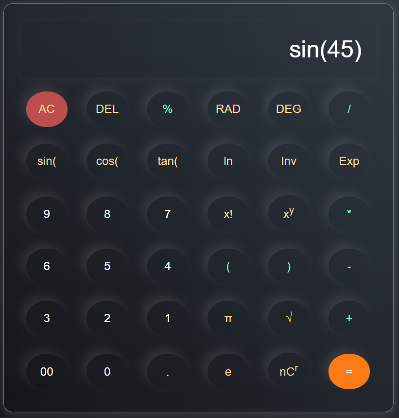
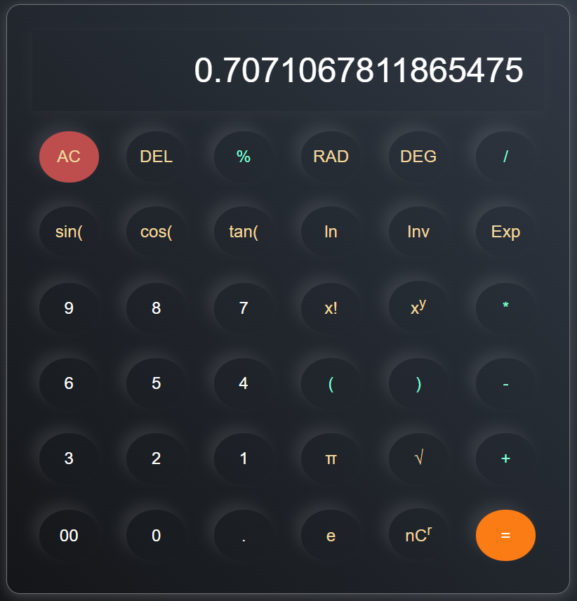

# 🧮 Basic Scientific Calculator

A simple yet powerful **Scientific Calculator** built using **HTML, CSS, and JavaScript**.  
It supports basic arithmetic operations as well as advanced scientific functions like trigonometry, logarithms, factorials, and combinations.

---

## 🚀 Features

- ➕ Basic operations: Addition, Subtraction, Multiplication, Division
- 🧠 Scientific functions:
  - sin, cos, tan (supports DEG & RAD mode)
  - Natural logarithm (ln)
  - Factorial (!)
  - Power (xʸ)
  - π and e constants
  - Square root (√)
  - Combinations (nCr)
- 🔄 Angle mode toggle: Degrees / Radians
- 🧹 Clear (AC) and Delete (DEL) functionality
- ⌨️ Expression-based input system
- ⚡ Real-time expression evaluation using JavaScript engine

---

## 🛠️ Tech Stack

- **HTML5** – Structure
- **CSS3** – Styling
- **JavaScript (ES6)** – Logic and functionality

---

---

## ⚙️ How It Works

1. User clicks buttons to build a mathematical expression
2. Expression is stored as a string
3. On `=` press:
   - Expression is parsed
   - Math functions are converted into JavaScript `Math.*` equivalents
   - Result is calculated using `Function()` constructor
4. Output is displayed in the input box

---

## 📐 Supported Operations

| Feature        | Example |
|----------------|--------|
| Addition       | 5 + 3   |
| Trigonometry   | sin(30) |
| Logarithm      | ln(10)  |
| Factorial      | 5!      |
| Combination    | nCr     |
| Power          | x^y     |
| Constants      | π, e    |

---

## 🧠 Learning Outcomes

- DOM manipulation in JavaScript
- Event handling for buttons
- String parsing and expression evaluation
- Working with JavaScript `Math` library
- Handling scientific calculator logic
- Managing application state (input string, evaluation state)

---

## 👨‍💻 Author

**Nitakshi Azad**  

